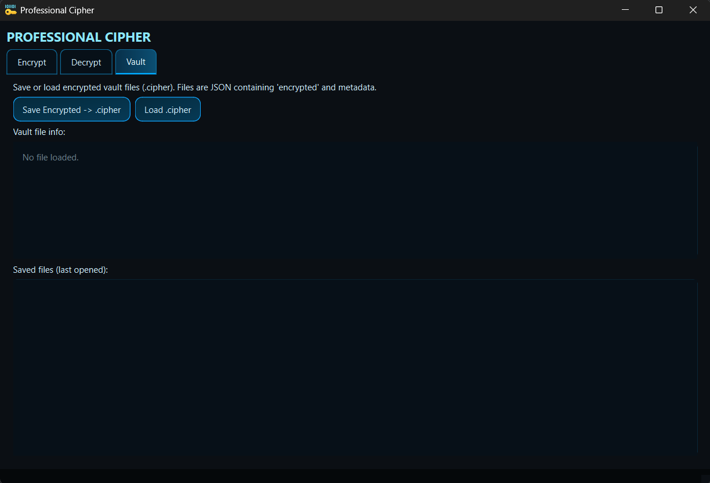

# Professional Cipher

```
   ___  ___ ___ ___ ___
  / __|/ __/ __| _ \ __|
 | (__ \__ \__ \   / _|
  \___||___/___/_|_\___|
```

A robust desktop tool for securely encrypting and decrypting secrets using AES-256-GCM. Designed for professionals who need a **local-first, secure, and easy-to-use GUI** to manage sensitive information.

---

## Features

- **Rock-Solid Encryption**: AES-256 in GCM mode ensures both confidentiality and integrity.
- **Secure Key Derivation**: PBKDF2 with 200,000 iterations and a unique salt per secret.
- **Multi-Item Management**: Encrypt or decrypt multiple secrets at once.
- **Encrypted Vaults**: Save encrypted secrets into `.cipher` files with metadata (creation time, item count).
- **Clipboard Auto-Clear**: Copy results to clipboard with optional auto-clear after a set time.
- **Password Strength Feedback**: Real-time guidance for creating strong master passwords.
- **Modern Neon GUI**: Clean, intuitive interface with light/dark theme support.

---

## Security

Your encrypted data is only as safe as your master password.

- **AES-GCM** provides authenticated encryption, verifying that data has not been tampered with.
- **PBKDF2 + unique salts** protects against brute-force and rainbow table attacks.
- **No password storage**—your master password is never saved anywhere.

> **Important:** Losing your master password means your secrets cannot be recovered.

---

## Installation

1. **Clone the repository**:

```bash
git clone https://github.com/AliGohar2151/professional_cipher
cd professional_cipher
```

2. **Create and activate a virtual environment**:

```bash
# Windows
python -m venv venv
.\venv\Scripts\activate

# macOS/Linux
python3 -m venv venv
source venv/bin/activate
```

3. **Install dependencies**:

```bash
pip install -r requirements.txt
```

---

## Running the GUI

Run the main application:

```bash
python cipher_gui.py
```

You’ll see a window with **three tabs**:

1. **Encrypt**

   - Enter secrets (one per line) and a master password.
   - Click **Encrypt** to generate an encrypted string.
   - Copy to clipboard with auto-clear support.

2. **Decrypt**

   - Paste your encrypted string and provide the master password.
   - Click **Decrypt** to view your secrets.
   - Copy results to clipboard.

3. **Vault**

   - Save your encrypted secrets as `.cipher` files.
   - Load `.cipher` files to decrypt and view contents.
   - Keep track of recently opened files.

---

## Screenshots




---

## GitHub

Check it out and contribute: [https://github.com/AliGohar2151/professional_cipher](https://github.com/AliGohar2151/professional_cipher)
